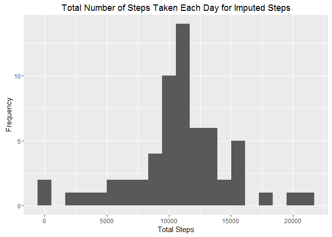
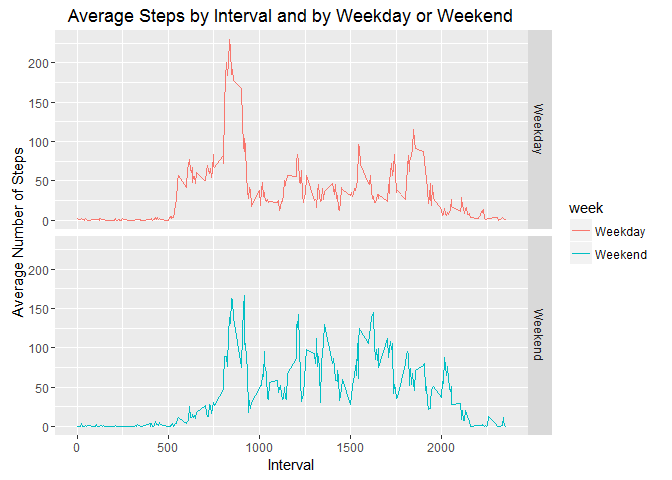

Reproducible Research Course Project 1
--------------------------------------

Introduction

It is now possible to collect a large amount of data about personal
movement using activity monitoring devices such as a Fitbit, Nike
Fuelband, or Jawbone Up. These type of devices are part of the
"quantified self" movement - a group of enthusiasts who take
measurements about themselves regularly to improve their health, to find
patterns in their behavior, or because they are tech geeks. But these
data remain under-utilized both because the raw data are hard to obtain
and there is a lack of statistical methods and software for processing
and interpreting the data.

This assignment makes use of data from a personal activity monitoring
device. This device collects data at 5 minute intervals through out the
day. The data consists of two months of data from an anonymous
individual collected during the months of October and November, 2012 and
include the number of steps taken in 5 minute intervals each day.

The data for this assignment can be downloaded from the course web site:

Dataset: Activity monitoring data \[52K\] The variables included in this
dataset are:

steps: Number of steps taking in a 5-minute interval (missing values are
coded as NA) date: The date on which the measurement was taken in
YYYY-MM-DD format interval: Identifier for the 5-minute interval in
which measurement was taken The dataset is stored in a
comma-separated-value (CSV) file and there are a total of 17,568
observations in this dataset.

read data from my working directory
-----------------------------------

    mydata <- read.csv("activity.csv")
    head(mydata)

    ##   steps       date interval
    ## 1    NA 2012-10-01        0
    ## 2    NA 2012-10-01        5
    ## 3    NA 2012-10-01       10
    ## 4    NA 2012-10-01       15
    ## 5    NA 2012-10-01       20
    ## 6    NA 2012-10-01       25

Remove missing step value from mydata for data analysis

    mydata1 <- mydata[complete.cases(mydata$steps),]
    head(mydata1)

    ##     steps       date interval
    ## 289     0 2012-10-02        0
    ## 290     0 2012-10-02        5
    ## 291     0 2012-10-02       10
    ## 292     0 2012-10-02       15
    ## 293     0 2012-10-02       20
    ## 294     0 2012-10-02       25

What is mean total number of steps taken per day?
-------------------------------------------------

Calculate the total number of steps taken per day

    Tstep <- with(mydata1,aggregate(list(steps=steps), by=list(date=date), sum))
    head(Tstep)

    ##         date steps
    ## 1 2012-10-02   126
    ## 2 2012-10-03 11352
    ## 3 2012-10-04 12116
    ## 4 2012-10-05 13294
    ## 5 2012-10-06 15420
    ## 6 2012-10-07 11015

Plot histogram of the total number of steps taken each day

    library(ggplot2)

    ## Warning: package 'ggplot2' was built under R version 3.2.5

    g <- qplot(steps, data=Tstep, geom="histogram",bins=20)
    g+xlab("Total Steps")+ylab("Frequency")+ggtitle("Total Number of Steps Taken Each Day")

Calculate and report the mean and median of the total number of steps
taken per day

    ##mean
    MNstep <- mean(Tstep$steps)
    MNstep

    ## [1] 10766.19

    ##median
    MDstep <- median(Tstep$steps)
    MDstep

    ## [1] 10765

What is the average daily activity pattern?
-------------------------------------------

calculate average steps by interval

    Avgstep <- with(mydata1,aggregate(list(steps=steps), by=list(interval=interval), mean))
    head(Avgstep)

    ##   interval     steps
    ## 1        0 1.7169811
    ## 2        5 0.3396226
    ## 3       10 0.1320755
    ## 4       15 0.1509434
    ## 5       20 0.0754717
    ## 6       25 2.0943396

plot the averge steps by interval

    g <- qplot(interval,steps,data=Avgstep,geom="line")
    g+xlab("Interval")+ylab("Average Number of Steps")+ggtitle("Avergae Number of Steps by 5-minutes Interval")

find the interval for maxnum step

    mm <- Avgstep[which.max(Avgstep$steps),]
    mm

    ##     interval    steps
    ## 104      835 206.1698

Imputing missing values
-----------------------

calculate total number of missing steps

    miss <- mydata[is.na(mydata$steps),]
    sum(is.na(miss$steps))

    ## [1] 2304

using the average steps by interval which I calculated above to impute
the missing steps

    miss$steps <- Avgstep$steps[Avgstep$interval %in% miss$interval]

create a new data set with imputed missing values

    mydata2 <- rbind(mydata1,miss)

re-calculate total number of steps by date

    TstepImput <- with(mydata2,aggregate(list(steps=steps), by=list(date=date), sum))

plot histogram for total steps by date again, this time use imputed data

    g <- qplot(steps, data=TstepImput, geom="histogram",bins=20)
    g+xlab("Total Steps")+ylab("Frequency")+ggtitle("Total Number of Steps Taken Each Day for Imputed Steps")

find step mean and median

    ##mean
    meanImput <- mean(TstepImput$steps)
    meanImput

    ## [1] 10766.19

    ##median
    medianImput <- median(TstepImput$steps)
    medianImput

    ## [1] 10766.19

Are there differences in activity patterns between weekdays and weekends?
-------------------------------------------------------------------------

create a new variable (week) flags weekday and weekend

    mydata2$week <- ifelse((weekdays(as.Date(mydata2$date))=="Saturday" | weekdays(as.Date(mydata2$date))=="Sunday"),"Weekend","Weekday")

calculate mean of steps by interval and week variable

    TWstep <- with(mydata2,aggregate(list(steps=steps), by=list(interval=interval,week=week), mean))

plot the mean steps by interval for both weekday and weekend

    g <- qplot(interval,steps,data=TWstep,geom="line",color=week)
    g+xlab("Interval")+ylab("Average Number of Steps")+ggtitle("Average Steps by Interval and by Weekday or Weekend")+facet_grid(week~.)

Yes, the patterns are different between weekday and weekend.
